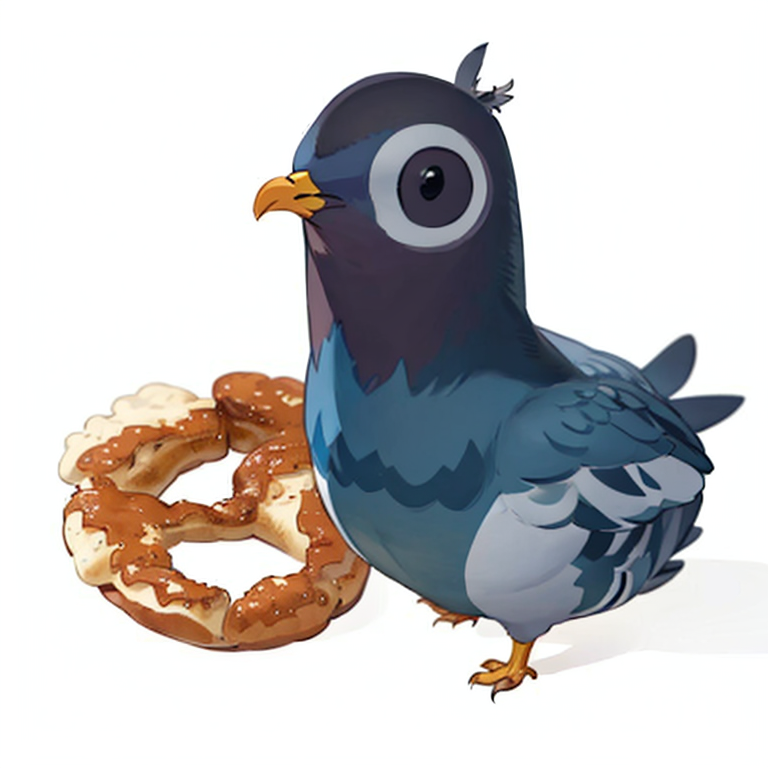

# PIGEON 101

> Team: 
>
> - Developer: Jingyi Jia
> - UI/UX: Jingyi Xu, Jing Wang, Chrissi Friedrich

https://github.com/elaineJJY/Pigeon-101/assets/62991370/68902894-b433-45a9-8a2e-4fd881450134

# Concept

Munich is an urban landscape that is known for its high population density. But humans are not the only ones who inhabit this rocky cityscape. Amongst other wild animals, Pigeons live side by side with humans and use the city as their habitat. The project aims to project the viewer into the perception of a pigeon to experience the cityscape with a new focus and see the urban context with different eyes. With the use of augmented reality, the user is able to see abstract aspects of a Pigeons life and is drawn into the twisted reality of urban wildlife.

.jpg)

## THE PIGEON-CYCLE

The app is concepted around 3 essential parts of a Pigeons life that the users interactions are cycling through. Though in a first initiation, the app recognizes the users hand and in a special trigger animation turns their hand into a wing. Starting from here, oversized pigeons roam around the user in the city and the pigeon-cycle begins.

As the first part, the user is confronted with feeding in the city. While food randomly appears, the animated pigeons immediately try to eat any food around them, lea- ving few time for the user themselves to get to any of it. If they are able to do so, the second part of the pigeon-cycle is triggered.

In courtship, other pigeons are trying to mate with the user. The oversized birds are now lovestruck and approach while audibly showing their interest. The pigeon that succeeds in mating then switches to the third part of the pigeon-cycle.

During nesting, pigeons rely on steep and unaccessible outcrops that are abundant in the cityscape. As the user builds their nest on the animated cliffside, a new pigeon joins the others and the pigeon-cycle begins from the start.

# Sponsors

